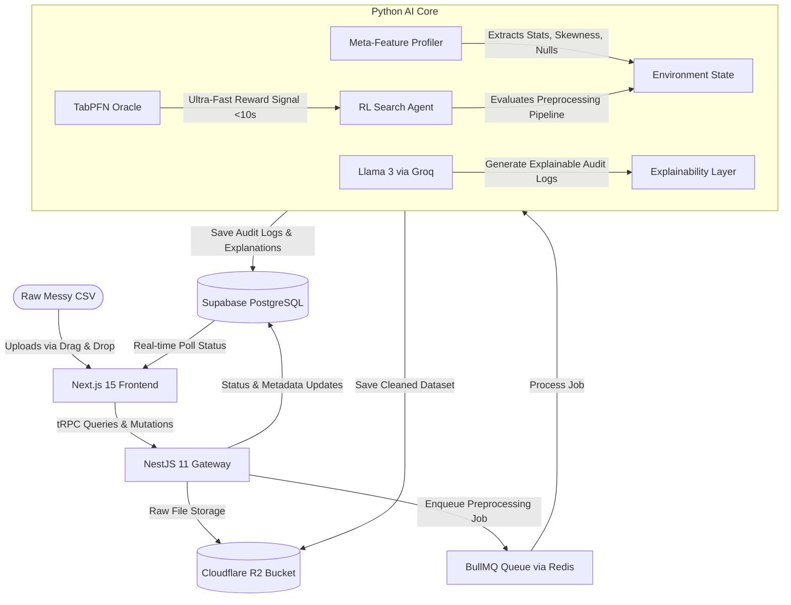

# MetaPrep.AI: The Explainable Meta-Learning Data Preprocessing Engine
> **An Intelligent, Reinforcement Learning-Driven Tabular Data Preparation Engine with Active Human-in-the-Loop Feedback & Compliance-Ready Audit Trails.**

---

## 🚀 The Core Vision
MetaPrep.AI addresses the biggest bottleneck in modern AI: **80% of data preparation is spent on manual, error-prone data cleaning.** 

Unlike black-box AutoML platforms (DataRobot, H2O.ai) that lock your clean data inside their systems, or static wrangling platforms (Alteryx, Trifacta) that rely on primitive heuristics, **MetaPrep.AI** uses a reinforcement learning search agent paired with **TabPFN** (a Prior-Data Fitted Transformer Network) to discover the mathematically optimal preprocessing sequence for *your* specific dataset. It then explains every single pipeline transformation in plain, compliance-ready English using LLMs, continuously adapting to your domain overrides over time.

---

## 📊 Project SWOT Analysis

```
                STRENGTHS                                       WEAKNESSES
 ┌──────────────────────────────────────────┐    ┌──────────────────────────────────────────┐
 │ • RL-driven pipeline optimization search │    │ • TabPFN has scale limits (optimized for │
 │ • In-Context tabular learning (<0.5s)    │    │   small-to-medium data <=10k rows).      │
 │ • LLM Explanation layer for transparency │    │ • Cost of LLM tokens for heavy datasets  │
 │ • Active Human-in-the-Loop tuning        │    │   (mitigated by Groq/Llama 3 pricing).   │
 └──────────────────────────────────────────┘    └──────────────────────────────────────────┘
              OPPORTUNITIES                                       THREATS
 ┌──────────────────────────────────────────┐    ┌──────────────────────────────────────────┐
 │ • Massive B2B market in regulated domains│    │ • Rapid advances in native preprocessing │
 │   (Finance/Healthcare compliance).       │    │   inside standard ML frameworks.         │
 │ • Highly effective PLG viral growth loop │    │ • Cleanlab expanding into automated      │
 │   via interactive Preflight Reports.     │    │   reinforcement pipeline exploration.    │
 └──────────────────────────────────────────┘    └──────────────────────────────────────────┘
```

---

## 🛠️ High-Level System Architecture

The following diagram illustrates the monorepo design, showcasing the tRPC client-server link, background job queues, and the Python AI Core's internal loop:



---

## 💻 Tech Stack Blueprint

### 1. Frontend & Client-Server Communication
* **Framework**: Next.js 15 (App Router, TailwindCSS, Shadcn/UI, React-Dropzone)
* **State & Fetching**: TanStack Query (React Query) for visual data caching.
* **API Bridge**: **tRPC** — binds frontend Types to backend NestJS routes for full compile-time Type safety (zero manual type writing).

### 2. Backend Gateway & Job Processing
* **Engine**: NestJS 11 (TypeScript, Express)
* **Job Scheduler**: **BullMQ** running over **Upstash Redis** (handles async file uploads, status updates, and FastAPI task dispatching safely under high traffic).
* **Database**: **Supabase (PostgreSQL)** for dataset records, explanation logs, and active learning corrections.
* **File Bucket**: **Cloudflare R2** (S3-compatible, ultra-low cost, zero egress fees).

### 3. Python AI Core (FastAPI)
* **TabPFN**: Prior-Data Fitted Network. A transformer model pre-trained on millions of datasets that performs instant in-context predictions in a single forward pass without training.
* **Reinforcement Learning Engine**: Custom Gym-style environment translating column states (meta-features) into optimal preprocessing actions.
* **LLM Layer**: Llama 3 running on **Groq** for sub-second, highly structured JSON explanation generation.
* **XGBoost**: Gradient Boosted Trees model used in the Active Learning Feedback loop to memorize and adapt the cleaning agent's policy to manual user overrides.

## 🗺️ Roadmap & Phase Plan

The complete engineering roadmap and step-by-step build plans for all phases are documented in the dedicated architecture guide:
👉 See **[AGENTS.md](file:///c:/Users/user/Downloads/openData/architecture-roadmap/AGENTS.md)** for the complete 11-phase breakdown of NestJS tasks, FastAPI endpoints, database schemas, and reinforcement learning agent code.

---


## 🏃 Run Locally

1. **Clone the repo and install packages**:
   ```bash
   npm install -g turbo
   bun install
   ```

2. **Spin up development environments concurrently**:
   ```bash
   npm run dev:all
   ```

3. **Verify running services**:
   * Frontend: `http://localhost:3000`
   * NestJS API Gateway: `http://localhost:3001`
   * FastAPI AI Engine: `http://localhost:8000`
